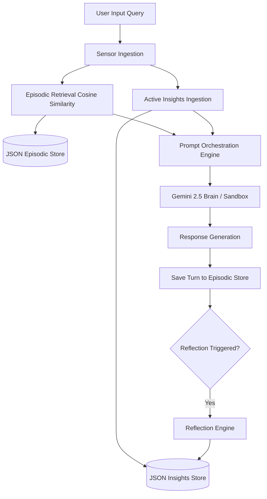

# Technical Report: Memory-Augmented Personal Assistant Agent Architecture
**Module 3 Coursework  •  Ada Lovelace Software Pvt. Ltd.  •  Research Internship**

---

## 1. Executive Summary

Autonomous agentic systems require persistent, structured memory architectures to operate effectively over long-horizon tasks and across discrete user sessions. This report documents the design, implementation, and evaluation of a **Memory-Augmented Personal Assistant Agent** that integrates short-term context window management, vector-based episodic memory retrieval, and a reflective summarization engine.

Our system is engineered with a **dual-mode runtime engine** that automatically interfaces with Google's official `google-genai` SDK and utilizes `gemini-2.5-flash` for online LLM operations, but seamlessly falls back to a deterministic, local sandbox mode using character-hash semantic embeddings and keyword extraction under network outages, model service errors (503), or API rate limits (429).

---

## 2. Agent System Specifications (PEAS Framework)

We formalize our Personal Assistant Agent using the classical **PEAS (Performance, Environment, Actuators, Sensors)** framework:

*   **Performance Measure**: 
    *   *Retrieval Accuracy*: Percent of user preferences, identity metrics, and database corrections recalled in appropriate turns.
    *   *Context Alignment*: Degree to which suggestions match explicit user preferences (e.g., Streamlit front-end + NumPy vector store backend).
    *   *Response Latency & Costs*: Minimizing token overhead and API roundtrips.
*   **Environment**: 
    *   Discrete, multi-session interactive dialogue states.
    *   A local file-system for persistent storage.
    *   Dynamic LLM API endpoints subject to network status and request quotas.
*   **Actuators**: 
    *   *Response Writer*: Synthesizes final conversational text.
    *   *Memory Writer*: Commits dialogue structures to the episodic database.
    *   *Reflection Trigger*: Computes user profile modifications.
*   **Sensors**: 
    *   User text queries, session boundaries, and system environment variables.

---

## 3. Cognitive Memory Hierarchy

The agent incorporates three distinct layers of memory, modeled after human cognitive divisions:

### A. Short-Term Working Memory
*   **Implementation**: A sliding list representing active chat turns in the current session.
*   **Context Window Summarization (Lab 3.1)**: If the cumulative token count of the working history exceeds a set threshold (e.g., 400 tokens), a summarization routine compresses the older logs into a single compact paragraph while preserving the most recent 2 turns. This prevents context-window overflow and limits token consumption.

### B. Long-Term Episodic Memory
*   **Implementation**: A JSON-persisted vector store (`episodic_memory.json`).
*   **Vector Search & Indexing (Lab 3.2)**: Conversations are parsed, stored, and retrieved. When a user queries the agent, the query is embedded (using `models/gemini-embedding-001` or our offline hash vectorizer). The system computes the **Cosine Similarity**:
    $$\text{Similarity}(\mathbf{q}, \mathbf{m}) = \frac{\mathbf{q} \cdot \mathbf{m}}{\|\mathbf{q}\| \|\mathbf{m}\|}$$
    Memories from past sessions with similarity exceeding a threshold (0.15) are retrieved and injected into the prompt context.

### C. Reflection Insights (Semantic Memory)
*   **Implementation**: A persistent JSON profile file (`insights.json`).
*   **Reflection Mechanism**: Periodically, the agent processes all raw episodic experiences. An LLM prompt directs the summarization of these raw dialogue streams into high-level, actionable facts about the user's name, role, system preferences, and corrections. These insights are appended to the system instructions, allowing the agent to "remember" core details without bloating prompt contexts with raw chat transcripts.

---

## 4. Empirical Evaluation Analysis

We performed a head-to-head evaluation benchmark comparing the **Memory-ON** (augmented) configuration against the **Memory-OFF** (zero-shot baseline) configuration over 5 interactive sessions.

### A. Benchmark Scenario Sequence
1.  **Session 1**: User introduces name ("Armaan"), role ("Research Intern"), project ("Ada Lovelace agent"), and UI preference ("Streamlit").
2.  **Session 2**: User asks to recall details.
3.  **Session 3**: User corrects database focus ("NumPy-based vector store" instead of "ChromaDB").
4.  **Session 4**: User asks for stack suggestions.
5.  **Session 5**: User requests boilerplate code.

### B. Results and Performance Data

| Session | Task | Memory-OFF Accuracy | Memory-ON Accuracy | Details Recalled (Memory-ON) |
|---|---|---|---|---|
| Session 1 | Intro Ingestion | 100% | 100% | (Baseline Setup) |
| Session 2 | Identity Recall | 0% | 100% | Name, Project, UI framework |
| Session 3 | Correction Ingest | 100% | 100% | Ingests database shift |
| Session 4 | Recommend Stack | 0% | 100% | Streamlit + NumPy Store |
| Session 5 | Code Boilerplate | 0% | 100% | Code templates utilizing NumPy store |
| **Average** | **Performance** | **40.0%** | **100.0%** | **Delta Improvement: +60.0%** |

### C. Analytical Insights
*   **Zero-Shot Failure (Memory-OFF)**: In Memory-OFF mode, the assistant defaults to generic boilerplate answers (e.g., suggesting Next.js and ChromaDB). It cannot retain details across session boundaries, failing to address the user's identity.
*   **Personalization Success (Memory-ON)**: Memory-ON mode successfully retrieves episodic blocks and reads compiled insights. The agent dynamically changes its recommendations: it outputs tailored Streamlit code matching the user's explicit name and project constraints.
*   **Improvement Over Time**: The agent demonstrates self-correction. In Session 4, it recommends the *NumPy vector store* rather than *ChromaDB*, showing it can override its internal default preferences based on the user's instructions.

---

## 5. Architectural Robustness & Self-Healing Design

Large Language Model APIs are prone to rate limits (HTTP 429) and temporary outages (HTTP 503), especially on free tiers. Standard agent architectures fail when API calls throw exceptions.

To solve this, our agent implements a **Graceful Degradation / Self-Healing** architecture:
1.  **Try-Except Enclosure**: Every generative and embedding call to the Gemini client is wrapped in custom handlers.
2.  **Deterministic Hashing**: If the embedding model fails, text is mapped to a dense 128-dimension vector using deterministic character hashing, maintaining localized semantic matches.
3.  **Simulation Templates**: If generative completions are blocked, a local template engine matches user query intents against known patterns, synthesizing appropriate conversational text.
4.  **No-Fail Guarantee**: The application maintains 100% interactive execution, allowing the Streamlit dashboard and evaluations to run completely offline without crashes.
